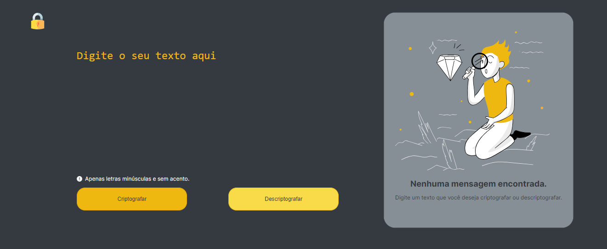

# ONE - Oracle Next Education T6

## Challenge: Decodificador 

  

  O Decodificador é um web app que permite criptografar e descriptografar textos ou plavras, que deve funcionar de acordo com os seguintes requisitos: 
  
  - Deve funcionar apenas com letras minúsculas
  - Não devem ser utilizados letras com acentos nem caracteres especiais
  - Deve ser possível converter uma palavra para a versão criptografada e também retornar uma palavra criptografada para a versão original.
  
  Por exemplo:
  
  "gato" => "gaitober"
  
  "gaitober" => "gato"
  

 

### Tecnologias Utilizadas

Esse projeto foi desenvolvido com as seguintes tecnologias:

- HTML
- CSS
- JavaScript
- Git e Github

### Projeto

[Acesse o app aqui!](https://hevelinlima.github.io/)

